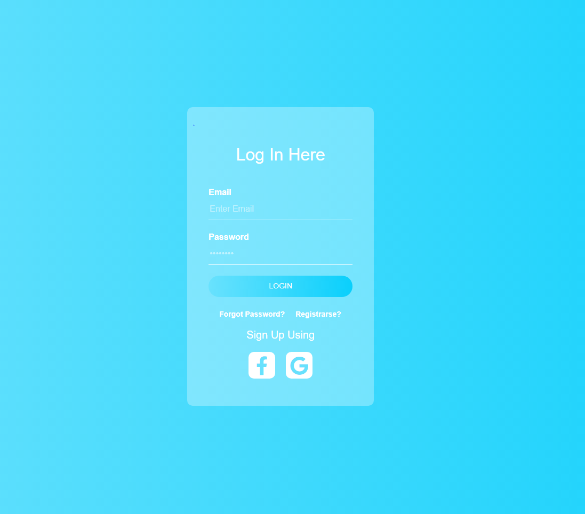
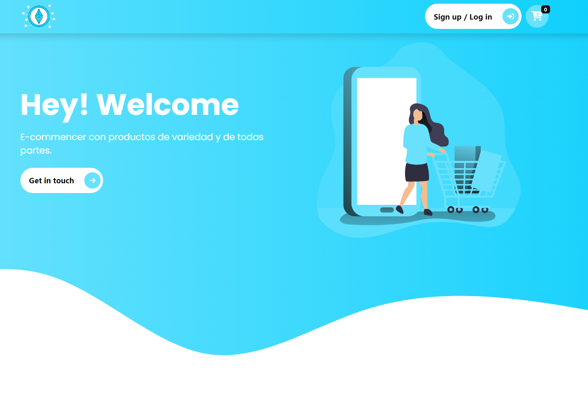
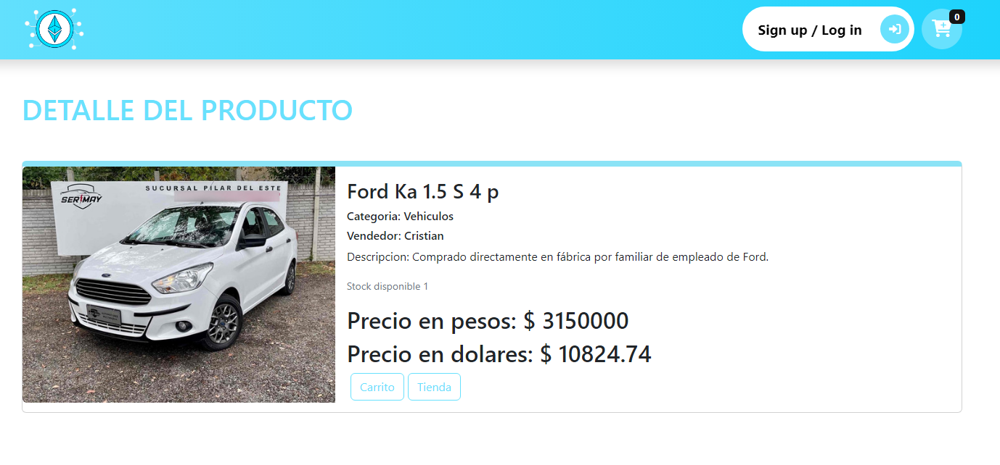
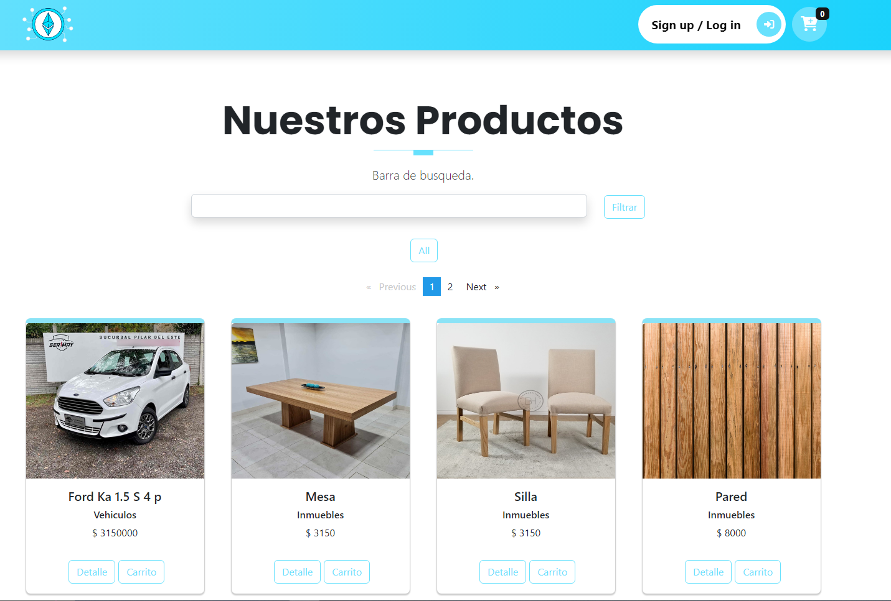
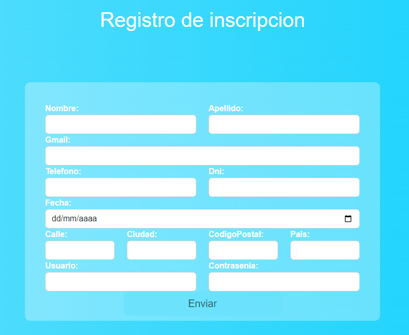

# Ecommencer

Hello, My name is Brandon and this project was generated with [Angular CLI](https://github.com/angular/angular-cli) version 14.1.0.

These are previews of the frontEnd from the ecommencer,  screenshots.

  <h1 align="center">Login</h1> 

  

  <h1 align="center">Dashboard</h1> 

  

  <h1 align="center">Product detail</h1> 

  

  <h1 align="center">Dashboard Product</h1> 

  

  <h1 align="center">Registration</h1> 

  

<h4 align="end">Thank you for watching </h4>

